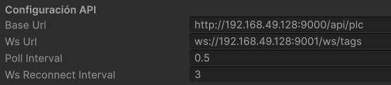

# Digital Twin Framework

> Paquete de Unity para la conexión y simulación con PLC SIM. Proporciona una capa de integración entre Unity y la API de PLC SIM, junto con herramientas HMI y componentes prefabricados listos para usar en entornos de gemelo digital.

---

## Contenido

- [Requisitos](#requisitos)
- [Instalación](#instalación)
- [Módulos](#módulos)
  - [Api Conexion Manager](#api-conexion-manager)
  - [HMI](#hmi)
  - [Variador](#variador)
- [Notas de uso](#notas-de-uso)

---

## Requisitos

- **Unity** `6000.3.19f1` o superior

---

## Instalación

### Paso 1 — Importar NativeWebSocket

Abre el Package Manager (`Window > Package Manager`), pulsa **+** y selecciona *Add package from git URL*. Introduce:

```
https://github.com/endel/NativeWebSocket.git#upm
```

### Paso 2 — Importar Digital Twin Framework

Repite el proceso con la URL de este paquete:

```
https://github.com/Unity-PLCSIM/Package_DigitalTwinFramework.git
```

### Paso 3 — Configurar el Player

En `Edit > Project Settings > Player`, aplica los siguientes ajustes:

| Ajuste | Valor |
|--------|-------|
| Allow HTTP | `Always Allowed` |
| Input System | `Both` (Input System + Input Manager) |

### Paso 4 — Añadir Event System

En la **Hierarchy**, añade `UI > Event System`.

---

## Módulos

### Api Conexion Manager

#### Configuraciones previas
Antes que nada debemos configurar la conexión con la API. Dentro del inspector del objeto debemos modificar los siguientes valores



- **Base Url** debe de coincidir la ip de la máquina dónde lanzamos la Api y el puerto que nos indica en consola que esta API REST
- **Ws Url** debe de coincidir la ip de la máquina dónde lanzamos la Api y el puerto que nos indica en consola que esta WebSocket
- **Poll Interval** indica cada cuantos segundos se hará polling en caso de no usar Web Soket
- **Ws Reconnect Interval** indica cuantos reintentos de conexion a los WebSokets se harán

*Esto también se puede hacer dentro del código `ApiConexionManager/Scripts/ApiInterface.cs`*

#### Conexión con instancia PLC SIM

Cuando ejecutamos la aplicación automáticamente se buscan las instancias que publica la Api. Si solo hay una se conecta automáticamente a ella. 

Mediante el botón `Instancias PLC` se muestra una tabla con las instancias disponibles, con botones que nos permiten conectarnos y desconectarnos de ellas. Además en la parte superior derecha hay dos botones que nos permiten poner la instancia a la que estemos conectados en RUN o STOP.

#### Tablas de Tags

Mediante el botón `Tags PLC` se nos muestra una tabla con todos los tags cargados en el plc. Están agrupados por Inputs, Outputs... y todos aquellos tipos de datos que hayamos creado.

Todos los tags están en la tabla por defecto llamada Principal. Podemos crear otras mediante el botón `+`. Y asociar tags a estas nuevas tablas mediante un botón a la izquierda del nombre del tag. Además se permite cambiar el valor de todos los tags menos aquellos que sean de salida.

---

### HMI

Pantalla de interfaz hombre-máquina integrada en la escena de Unity.

#### Configuración

**1. Añadir HMI Root**

Añade el prefab **HMI Root** en la Hierarchy.

**2. Prefab de botones**

Añade el prefab de botones como hijo de `Panel HMI` (hijo de `HMI Root`).

- Ajusta la posición en pantalla mediante las coordenadas del `Transform`.
- En el Inspector, asigna el **tag** del PLC asociado a cada botón.
- Cambia el texto que aparece en el botón modificando el campo de texto de su hijo `Text (TMP)` desde el Inspector.

> ⚠️ **Importante:** los botones únicamente soportan toggle de variables booleanas.

### 3. Elementos de simulación

Mediante clic derecho en `Panel HMI` (hijo de `HMI Root`) > UI (Canvas) > Image creamos lo que sería nuestro elemento de simulación. Dentro del inspector podemos sustituir la imagen por lo que queremos que se vea dentro de la pantalla.

El comportamiento de estos objetos se debe de programar dentro de un script que le asociemos. La clase de este script debe de heredar de `ObjetoHMI`. Al heredar de este script, obtenemos variables de configuración enfocadas a la lectura (`tagLectura` y `objetoAsociado`) y heredamos de su clase padre `HMIBase` las variables enfocadas a la escritura (`tagEscritura` y `tagType`). 

Cualquier script derivado está obligado a implementar el método abstracto `AlActualizar(bool estado)` para definir visualmente qué ocurre cuando el valor cambia. Estos elementos pueden realizar distintos tipos de conexiones:

*   **Otro Elemento -> Elemento:** Se configura asignando un objeto de la escena en la variable `objetoAsociado` dentro del inspector. En lugar de consultar al PLC, el elemento se suscribe al evento `OnEstadoCambiado` de su `objetoAsociado` durante el método `Start()`. Cuando el objeto padre cambia de estado, dispara este evento, lo que invoca el método interno del hijo y termina desencadenando su propia implementación de `AlActualizar(bool estado)`. Esto permite vincular elementos en cascada para que reaccionen a la vez al mismo evento sin duplicar conexiones al servidor.
*   **Elemento -> Tag:** Permite enviar información hacia el PLC. Dentro del inspector se debe definir la variable de destino en `tagEscritura` y su formato en `tagType`. Para ejecutar la acción se utiliza el método protegido `Comunicar()`, el cual envía el dato a la API y realiza inmediatamente una lectura automática del tag para confirmar que la escritura ha sido exitosa y mantener la consistencia.
*   **Tag -> Elemento:** Permite que el elemento gráfico reaccione al PLC. Se configura introduciendo el nombre de la variable en `tagLectura`. El script se suscribe a los cambios vía WebSocket y ejecuta una lectura forzada inicial para sincronizar su estado al arrancar. Cada vez que llega un nuevo valor por el WebSocket, se actualiza el estado interno y se ejecuta el método abstracto `AlActualizar(bool estado)` para reflejar el cambio en la pantalla.

#### Uso en editor

> Para continuar modificando la escena, **desactiva `HMI Root`** en la Hierarchy. Asegúrate de **reactivarlo** antes de ejecutar o hacer build de la simulación.

#### Uso en ejecución

| Tecla | Acción |
|-------|--------|
| `H` | Abrir / cerrar la pantalla HMI |

---

### Variador

!!!! añadir explicacion

---

## Uso de ApiInterface en Unity

`ApiInterface` es un Singleton accesible desde cualquier script mediante `ApiInterface.Instance`.  
Todas las llamadas son asíncronas: reciben un callback `onSuccess` y un `onError` opcional.

### Instancias

```csharp
// Obtener instancias disponibles
ApiInterface.Instance.GetInstances(
    instances => { foreach (var i in instances) Debug.Log(i.ID + " - " + i.Name); },
    err => Debug.LogError(err)
);

// Conectarse a una instancia por ID
ApiInterface.Instance.ConnectInstance("0",
    msg => Debug.Log("Conectado: " + msg),
    err => Debug.LogError(err)
);
```

### Lectura de Tags

```csharp
// Leer un tag genérico (devuelve string)
ApiInterface.Instance.GetTag("Motor", "Bool",
    value => Debug.Log("Motor: " + value),
    err => Debug.LogError(err)
);

// Leer un tag Bool (devuelve bool)
ApiInterface.Instance.GetTagBool("Motor",
    value => Debug.Log("Motor: " + value)
);

// Leer un tag entero (devuelve int)
ApiInterface.Instance.GetTagInt("Velocidad", "DInt (Int32)",
    value => Debug.Log("Velocidad: " + value)
);

// Obtener todos los tags con su valor en una sola petición
ApiInterface.Instance.GetTagsWithValues(
    tags => { foreach (var t in tags) Debug.Log(t.Name + ": " + t.Value); },
    err => Debug.LogError(err)
);
```

### Escritura de Tags

```csharp
// Escribir un tag genérico
ApiInterface.Instance.SetTag("Marcha", "Bool", "true",
    msg => Debug.Log(msg)
);

// Escribir un Bool
ApiInterface.Instance.SetTagBool("Marcha", true,
    msg => Debug.Log(msg)
);

// Escribir un entero
ApiInterface.Instance.SetTagInt("Velocidad", "DInt (Int32)", 150,
    msg => Debug.Log(msg)
);
```

### Polling Automático

Suscribe un tag para que se lea automáticamente cada `pollInterval` segundos  
(configurable en el Inspector de `ApiInterface`, por defecto `0.5s`):

```csharp
// Suscribir
ApiInterface.Instance.SubscribeTag("Motor", "Bool",
    value => Debug.Log("Motor: " + value)
);

// Cancelar suscripción
ApiInterface.Instance.UnsubscribeTag("Motor");
```

---
## Notas de uso

- Este paquete ha sido validado con Unity `6000.3.19f1`. No se garantiza compatibilidad con versiones anteriores.
- La conexión con PLC SIM se realiza a través de la API incluida en el paquete.
- Las tablas de tags son modificables directamente desde el editor de Unity.
